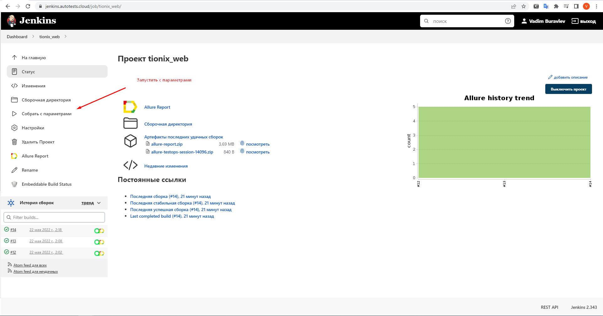
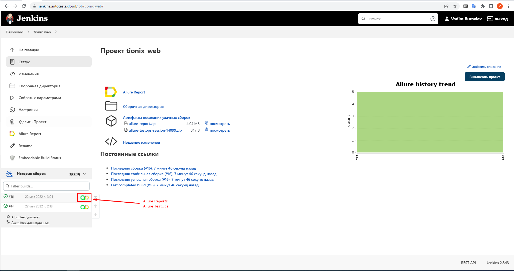
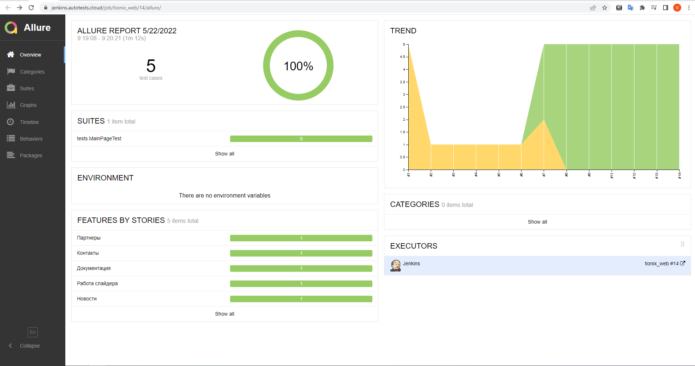
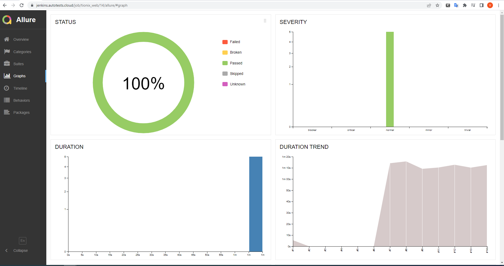
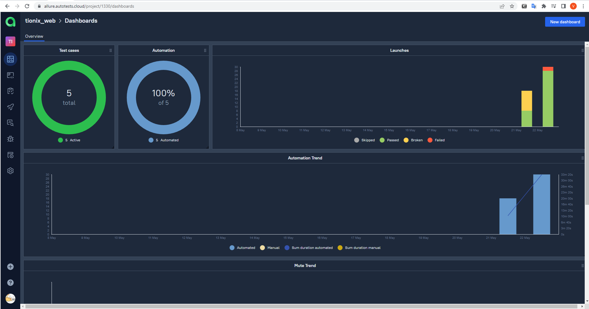
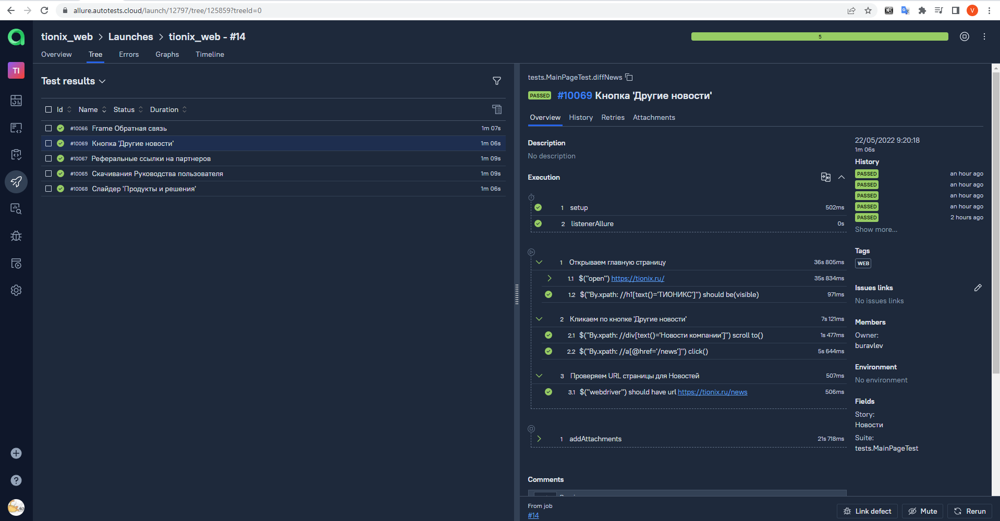
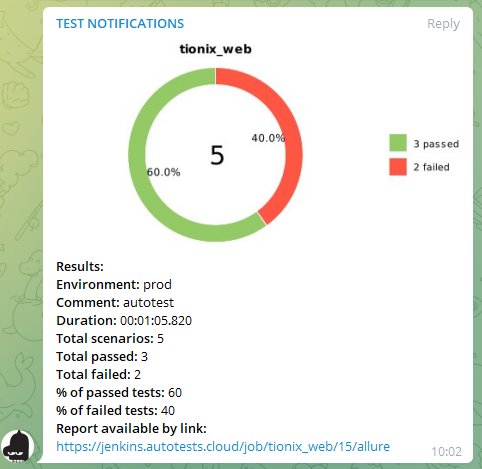
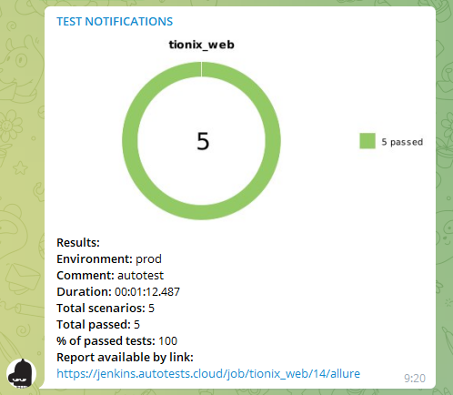
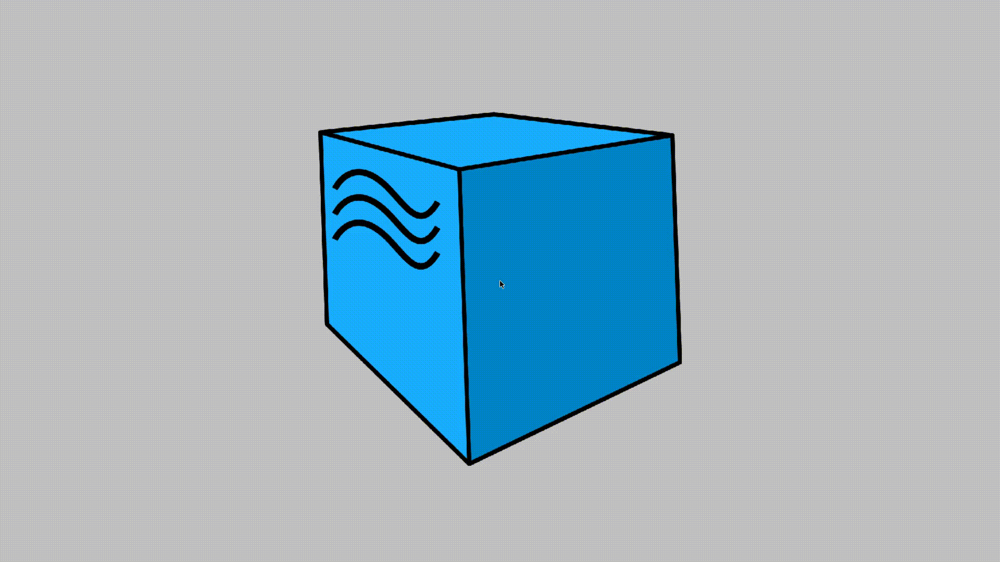

# Проект автоматизации веб-сайта <a target="_blank" href="https://tionix.ru">tionix.ru</a>

## :notebook:	Содержание

>  :heavy_check_mark: [Технологии и инструменты](#computer-технологии-и-инструменты)
>
>  :heavy_check_mark: [Тестовые проверки UI](#clipboard-тестовые-проверки-ui)
>
>  :heavy_check_mark: [Запуск тестов из терминала](#computer-Запуск-тестов-из-терминала)
>
>  :heavy_check_mark: [Запуск тестов в Jenkins](#computer-запуск-тестов-в-jenkins)
>
>  :heavy_check_mark: [Отчет о результатах тестирования в Allure Report](#-отчет-о-результатах-тестирования-в-allure-report)
>
>  :heavy_check_mark: [Отчет о результатах тестирования в Allure TestOps](#-отчет-о-результатах-тестирования-в-allure-testops)
>
>  :heavy_check_mark: [Интеграция с Allure TestOps](#-интеграция-с-allure-testops)
>
>  :heavy_check_mark: [Уведомления в Telegram с использованием бота Allure Notification](#-уведомления-в-telegram-с-использованием-бота-allure-notification)
>
>  :heavy_check_mark: [Пример запуска теста в Selenoid](#-пример-запуска-теста-в-selenoid)

## :computer: Технологии и инструменты

<p  align="center"

<code></code>
<code></code>
<code></code>
<code></code>
<code></code>
<code></code>
<code></code>
<code></code>
<code></code>
<code></code>
<code></code>
</p>


> *В данном проекте UI-автотесты написаны на <code><strong>*Java*</strong></code> с использованием фреймворка <code><strong>*Selenide*</strong></code>.*
>
>*Для сборки проекта используется <code><strong>*Gradle*</strong></code>.*
>
>*В качестве фреймворка для тестирования выбран <code><strong>*JUnit 5*</strong></code>.*
>
>*Запуск тестов выполняется с помощью CI <code><strong>*Jenkins*</strong></code>.*
>
>*<code><strong>*Selenoid*</strong></code> используется для запуска браузеров в контейнерах  <code><strong>*Docker*</strong></code>.*
>
>*<code><strong>*Allure Report, Allure TestOps, Telegram Bot*</strong></code> используются для визуализации результатов тестирования.*
>
>*В коде учтена возможность запуска тестов в разных браузерах<code><strong>*Chrome, Firefox, Opera*</strong></code> за счет присвоения индивидуальных конфигураций.*

## :clipboard: Тестовые проверки UI
>- [x] *Работа слайдера с продуктами*
>- [x] *Работа формы обратной связи*
>- [x] *Работа раздела новостей*
>- [x] *Работа реферальных ссылок на партнеров*
>- [x] *Доступности Руководства пользователя*

## :computer: Запуск тестов из терминала

### Локальный запуск тестов

*Пример конфигурационного файла для локального запуска из терминала находится в resourse/config/local_example.properties*

```bash
./gradlew clean test -DtypeConfig=local -Dthreads=1 -DurlWebSite=https://tionix.ru/
```

### Удаленный запуск тестов

*Пример конфигурационного файла для удаленного запуска из терминала находится в resourse/config/remote_example.properties*

```bash
./gradlew clean test -DtypeConfig=remote -Dthreads=5 -DurlWebSite=https://tionix.ru/
```
### Параметры сборки

> <code>BROWSER</code> – браузер, в котором будут выполняться тесты (_по умолчанию - <code>chrome</code>_).
>
> <code>BROWSER_VERSION</code> – версия браузера, в которой будут выполняться тесты (_по умолчанию - <code>91.0</code>_).
>
> <code>BROWSER_SIZE</code> – разрешени окна браузера, в котором будут выполняться тесты (_по умолчанию - <code>1920x1080</code>_).
>
> <code>REMOTE_URL</code> – адрес удаленного сервера, на котором будут запускаться тесты.
>
> <code>USER</code> - логин пользователя для подключения к Selenoid
>
> <code>PASSWORD</code> - пароль пользователя для подключения к Selenoid
>
> <code>THREADS</code> - количество одновременных запускаемых потоков для тестов.
>
> <code>TIMEOUT</code> - задержка в 'мс' Selenide.timeout(), в случае если тесты нестабильны, то можно улучшить ситуацию за счет увеличения данного параметра до 10000 (_по умолчанию - <code>4000</code>_).
>
><code>TIMEOUTATTACH</code> - задержка в 'мс' для прикрепления видео прохождения тестов, в случае если тесты нестабильны и появляется исключения при attachVideo в Allure, то можно улучшить ситуацию за счет увеличения данного параметра до 5000 (_по умолчанию - <code>1000</code>_).

##  Запуск тестов в [Jenkins]([https://jenkins.autotests.cloud/job/tionix_web/](https://jenkins.autotests.cloud/job/tionix_web/))
*Для запуска сборки необходимо указать значения параметров и нажать кнопку <code><strong>*Собрать*</strong></code>.*

<p align="center">
  
</p>

*После выполнения сборки, в блоке <code><strong>*История сборок*</strong></code> напротив номера сборки появятся
значки <code><strong>*Allure
Report*</strong></code> и <code><strong>*Allure
TestOps*</strong></code>, кликнув по которым, откроется страница с сформированным html-отчетом.*

<p align="center">
  
</p>

##  Отчет о результатах тестирования в [Allure Report](https://jenkins.autotests.cloud/job/tionix_web/allure/)

##  Отчет о результатах тестирования в [Allure TestOps](https://allure.autotests.cloud/project/1330/dashboards)

### :pushpin: Общая информация по отчетам о тестировании

*Главная страница Allure-отчета с:*

>- [x] <code><strong>*ALLURE REPORT*</strong></code> - отображает дату и время прохождения теста, общее количество выполненных кейсов, а также диаграмму с указанием процентного отношения и количества успешных, упавших и сломавшихся тестов к общему количеству
>- [x] <code><strong>*TREND*</strong></code> - отображает тренд прохождения тестов от сборки к сборке
>- [x] <code><strong>*SUITES*</strong></code> - отображает распределение результатов тестов по тестовым наборам
>- [x] <code><strong>*ENVIRONMENT*</strong></code> - отображает тестовое окружение, на котором запускались тесты (в данном случае информация не задана)
>- [x] <code><strong>*CATEGORIES*</strong></code> - отображает распределение неуспешно прошедших тестов по видам дефектов
>- [x] <code><strong>*FEATURES BY STORIES*</strong></code> - отображает распределение тестов по функционалу, который они проверяют
>- [x] <code><strong>*EXECUTORS*</strong></code> - отображает исполнителя текущей сборки (ссылка на сборку в Jenkins)

<p align="center">
  
</p>

<p align="center">
  
</p>

<p align="center">
  
</p>

##  Интеграция с [Allure TestOps](https://allure.autotests.cloud/project/1059/dashboards)

### :pushpin: Основной дашборд

<p align="center">
  
</p>

### :pushpin: Тест-кейсы

<p align="center">
  
</p>

##  Уведомления в Telegram с использованием бота [Allure Notification](https://github.com/qa-guru/allure-notifications)

> После завершения сборки специальный бот, созданный в <code>Telegram</code>, автоматически обрабатывает и отправляет сообщение с отчетом о пройденных тестах.

<p align="center">


</p>

##  Пример запуска теста в Selenoid

> К каждому тесту в отчете прилагается видео.
<p align="center">
  
</p>
